# Fix: Salvar availability_months no DynamoDB

## 🐛 Problema Identificado

O campo `availability_months` não estava sendo salvo no DynamoDB, impossibilitando a recuperação desses dados em sessões futuras para filtrar voos por mês.

### Fluxo Atual (Antes)
1. ❌ LLM retorna `availability_months` no `collectedData`
2. ❌ Dados são mapeados para `ProfileData` **SEM** `availability_months`
3. ❌ DynamoDB recebe `ProfileData` **SEM** `availability_months`
4. ❌ Ao buscar voos, não há informação de mês disponível

## ✅ Solução Implementada

### 1. Interface `UserProfile` Atualizada (`chat.interface.ts`)

```typescript
// ANTES
export interface UserProfile {
  origin: string;
  activities: string[];
  budget: number;
  purpose: string;
  hobbies: string[];
}

// DEPOIS
export interface UserProfile {
  origin: string;
  activities: string[];
  budget: number;
  availability_months?: string[]; // ✅ ADICIONADO
  purpose: string;
  hobbies: string[];
}
```

### 2. Repository: Salvar no DynamoDB (`chat-session.repository.ts`)

```typescript
// ANTES
const sanitizedProfileData = {
  origin: String(session.profileData?.origin || ''),
  activities: Array.isArray(session.profileData?.activities) ? 
    session.profileData.activities.filter(item => item !== undefined && item !== null && item !== '') : [],
  budget: Number(session.profileData?.budget || 0),
  purpose: String(session.profileData?.purpose || ''),
  hobbies: Array.isArray(session.profileData?.hobbies) ? 
    session.profileData.hobbies.filter(item => item !== undefined && item !== null && item !== '') : []
};

// DEPOIS
const sanitizedProfileData = {
  origin: String(session.profileData?.origin || ''),
  activities: Array.isArray(session.profileData?.activities) ? 
    session.profileData.activities.filter(item => item !== undefined && item !== null && item !== '') : [],
  budget: Number(session.profileData?.budget || 0),
  availability_months: Array.isArray(session.profileData?.availability_months) ?  // ✅ ADICIONADO
    session.profileData.availability_months.filter(item => item !== undefined && item !== null && item !== '') : [],
  purpose: String(session.profileData?.purpose || ''),
  hobbies: Array.isArray(session.profileData?.hobbies) ? 
    session.profileData.hobbies.filter(item => item !== undefined && item !== null && item !== '') : []
};
```

### 3. Repository: Ler do DynamoDB (`chat-session.repository.ts`)

```typescript
// ANTES
profileData: item.ProfileData || {
  origin: '',
  activities: [],
  budget: 0,
  purpose: '',
  hobbies: []
}

// DEPOIS
profileData: item.ProfileData || {
  origin: '',
  activities: [],
  budget: 0,
  availability_months: [], // ✅ ADICIONADO
  purpose: '',
  hobbies: []
}
```

### 4. Service: Mapeamento JsonChatSession → ChatSession (`chatbot.service.ts`)

```typescript
// ANTES
private mapToLegacySession(jsonSession: JsonChatSession): ChatSession {
  const profileData: UserProfile = {
    origin: jsonSession.collectedData.origin_name || '',
    activities: Array.from(jsonSession.collectedData.activities || []),
    budget: jsonSession.collectedData.budget_in_brl || 0,
    purpose: jsonSession.collectedData.purpose || '',
    hobbies: Array.from(jsonSession.collectedData.hobbies || [])
  };
  // ...
}

// DEPOIS
private mapToLegacySession(jsonSession: JsonChatSession): ChatSession {
  const profileData: UserProfile = {
    origin: jsonSession.collectedData.origin_name || '',
    activities: Array.from(jsonSession.collectedData.activities || []),
    budget: jsonSession.collectedData.budget_in_brl || 0,
    availability_months: Array.from(jsonSession.collectedData.availability_months || []), // ✅ ADICIONADO
    purpose: jsonSession.collectedData.purpose || '',
    hobbies: Array.from(jsonSession.collectedData.hobbies || [])
  };
  // ...
}
```

### 5. Service: Mapeamento ChatSession → JsonChatSession (`chatbot.service.ts`)

```typescript
// ANTES
private mapFromLegacySession(chatSession: ChatSession): JsonChatSession {
  const collectedData: CollectedData = {
    origin_name: chatSession.profileData?.origin || null,
    origin_iata: null,
    destination_name: null,
    destination_iata: null,
    activities: chatSession.profileData?.activities || null,
    budget_in_brl: chatSession.profileData?.budget || null,
    availability_months: null, // ❌ Sempre null
    purpose: chatSession.profileData?.purpose || null,
    hobbies: chatSession.profileData?.hobbies || null
  };
  // ...
}

// DEPOIS
private mapFromLegacySession(chatSession: ChatSession): JsonChatSession {
  const collectedData: CollectedData = {
    origin_name: chatSession.profileData?.origin || null,
    origin_iata: null,
    destination_name: null,
    destination_iata: null,
    activities: chatSession.profileData?.activities || null,
    budget_in_brl: chatSession.profileData?.budget || null,
    availability_months: chatSession.profileData?.availability_months || null, // ✅ CORRIGIDO
    purpose: chatSession.profileData?.purpose || null,
    hobbies: chatSession.profileData?.hobbies || null
  };
  // ...
}
```

## 🧪 Testes Criados

### 1. Testes Unitários (`date-converter.util.spec.ts`)

```typescript
describe('DateConverterUtil', () => {
  // ✅ 30 testes cobrindo:
  // - Conversão de meses para datas
  // - Normalização de nomes (acentos, maiúsculas)
  // - Múltiplos meses
  // - Arrays vazios/null/undefined
  // - Meses inválidos
  // - Durações variadas
  // - Compatibilidade com readonly arrays
});
```

**Cobertura:**
- ✅ Conversão de meses em português para datas
- ✅ Normalização de acentos e maiúsculas
- ✅ Abreviações (jan, fev, mar)
- ✅ Múltiplos meses (usa primeiro)
- ✅ Fallback para 30 dias quando null/undefined/vazio
- ✅ Garantia de 14 dias de antecedência
- ✅ Datas cruzando anos (Dez → Jan)
- ✅ Formato YYYY-MM-DD correto

### 2. Testes de Integração (`availability-months-integration.spec.ts`)

```typescript
describe('Availability Months Integration Test', () => {
  // ✅ Testa persistência completa no DynamoDB
  // ✅ Testa mapeamento JsonChatSession ↔ ChatSession
  // ✅ Testa conversão para parâmetros de busca de voo
  // ✅ Testa retrocompatibilidade com sessões antigas
});
```

**Cenários Testados:**
1. **Salvar e Recuperar:** Verifica se `availability_months` é salvo e recuperado corretamente
2. **Atualizar:** Verifica se atualizações funcionam
3. **Array Vazio:** Testa comportamento com array vazio
4. **Undefined:** Testa comportamento quando undefined (retorna array vazio)
5. **Conversão de Voos:** Verifica se meses são convertidos em datas corretas
6. **Múltiplos Meses:** Verifica se usa primeiro mês disponível
7. **Retrocompatibilidade:** Sessões antigas sem `availability_months` funcionam

## 📊 Fluxo Completo (Após Fix)

```mermaid
graph LR
    A[LLM] -->|collectedData| B[JsonChatSession]
    B -->|mapToLegacySession| C[ChatSession]
    C -->|ProfileData| D[DynamoDB]
    D -->|mapFromLegacySession| E[JsonChatSession]
    E -->|availability_months| F[convertToDateRange]
    F -->|departureDate/returnDate| G[Flight Search API]
```



### Antes (Dados Perdidos)
```
LLM → JsonChatSession ✅
      ↓
      availability_months: ["Janeiro", "Fevereiro"]
      ↓
mapToLegacySession ❌ (não mapeia)
      ↓
DynamoDB ❌ (não salva)
      ↓
Flight Search API ❌ (sem filtro de mês)
```

### Depois (Dados Preservados)
```
LLM → JsonChatSession ✅
      ↓
      availability_months: ["Janeiro", "Fevereiro"]
      ↓
mapToLegacySession ✅ (mapeia para ProfileData)
      ↓
DynamoDB ✅ (salva em ProfileData.availability_months)
      ↓
mapFromLegacySession ✅ (recupera para collectedData)
      ↓
convertToDateRange ✅ (Janeiro → 2026-01-15)
      ↓
Flight Search API ✅ (filtrado por mês)
```

## 🎯 Impacto

| Antes | Depois |
|-------|--------|
| ❌ Dados perdidos após salvar | ✅ Dados persistidos no DynamoDB |
| ❌ Impossível filtrar voos por mês | ✅ Voos filtrados pelo mês escolhido |
| ❌ Usuário precisa re-informar mês | ✅ Mês recuperado da sessão |
| ❌ Experiência inconsistente | ✅ Experiência fluida |

## 📝 Arquivos Modificados

### Backend
- ✅ `src/modules/chatbot/interfaces/chat.interface.ts` - Adicionado campo na interface
- ✅ `src/modules/chatbot/repositories/chat-session.repository.ts` - Salvar/ler do DynamoDB
- ✅ `src/modules/chatbot/chatbot.service.ts` - Mapeamento bidirecional

### Testes
- ✅ `src/modules/chatbot/utils/date-converter.util.spec.ts` - 30 testes unitários
- ✅ `src/modules/chatbot/availability-months-integration.spec.ts` - 10 testes de integração

## ✅ Como Testar Manualmente

### 1. Criar Sessão com Meses
```bash
# Inicia chat e responde perguntas
curl -X POST http://localhost:3000/chatbot/sessions \
  -H "Authorization: Bearer $TOKEN" \
  -d '{"userId": "test-user"}'

# Responde que quer viajar em "Janeiro e Fevereiro"
# ...continua entrevista...
```

### 2. Verificar no DynamoDB
```bash
aws dynamodb get-item \
  --table-name airdiscovery-chat-sessions \
  --key '{"SessionId": {"S": "SESSION_ID"}}'
```

**Deve conter:**
```json
{
  "ProfileData": {
    "origin": "São Paulo",
    "activities": ["Praia"],
    "budget": 3000,
    "availability_months": ["Janeiro", "Fevereiro"], // ✅ PRESENTE
    "purpose": "Lazer",
    "hobbies": []
  }
}
```

### 3. Buscar Voos
```bash
# API deve usar Janeiro (primeiro mês) para busca
GET /chatbot/sessions/{sessionId}/flights
```

**Resposta esperada:**
```json
{
  "departureDate": "2026-01-15", // ✅ Janeiro
  "returnDate": "2026-01-22",
  "flights": [...]
}
```

## 🚀 Executar Testes

```bash
# Testes unitários
npm test -- date-converter.util.spec.ts

# Testes de integração (requer DynamoDB local ou AWS)
npm test -- availability-months-integration.spec.ts

# Todos os testes do módulo chatbot
npm test -- src/modules/chatbot
```

## 📌 Retrocompatibilidade

### Sessões Antigas (Sem availability_months)
- ✅ Continuam funcionando normalmente
- ✅ `availability_months` retorna `[]` (array vazio)
- ✅ `convertToDateRange` usa fallback de 30 dias

### Migração Gradual
1. Sessões novas salvam `availability_months` ✅
2. Sessões antigas funcionam sem ✅
3. Não requer migração de dados ✅

## 🔧 Troubleshooting

### Problema: availability_months retorna []
**Causa:** LLM não preencheu o campo
**Solução:** Verificar prompt (já corrigido em `json-prompt-builder.ts`)

### Problema: Datas sempre 30 dias no futuro
**Causa:** `availability_months` está null/undefined/vazio
**Solução:** Verificar se está sendo salvo corretamente no DynamoDB

### Problema: Mês não reconhecido
**Causa:** Nome do mês inválido ou não mapeado
**Solução:** Verificar `MONTH_MAP` em `date-converter.util.ts`

## ✅ Checklist de Validação

- [x] Interface `UserProfile` atualizada
- [x] Repository salva `availability_months`
- [x] Repository lê `availability_months`
- [x] Mapeamento `mapToLegacySession` inclui campo
- [x] Mapeamento `mapFromLegacySession` inclui campo
- [x] Testes unitários criados (30 testes)
- [x] Testes de integração criados (10 testes)
- [x] Retrocompatibilidade garantida
- [ ] Testes passando (executar para validar)
- [ ] Verificado em ambiente de desenvolvimento
- [ ] Verificado com sessão real no DynamoDB
