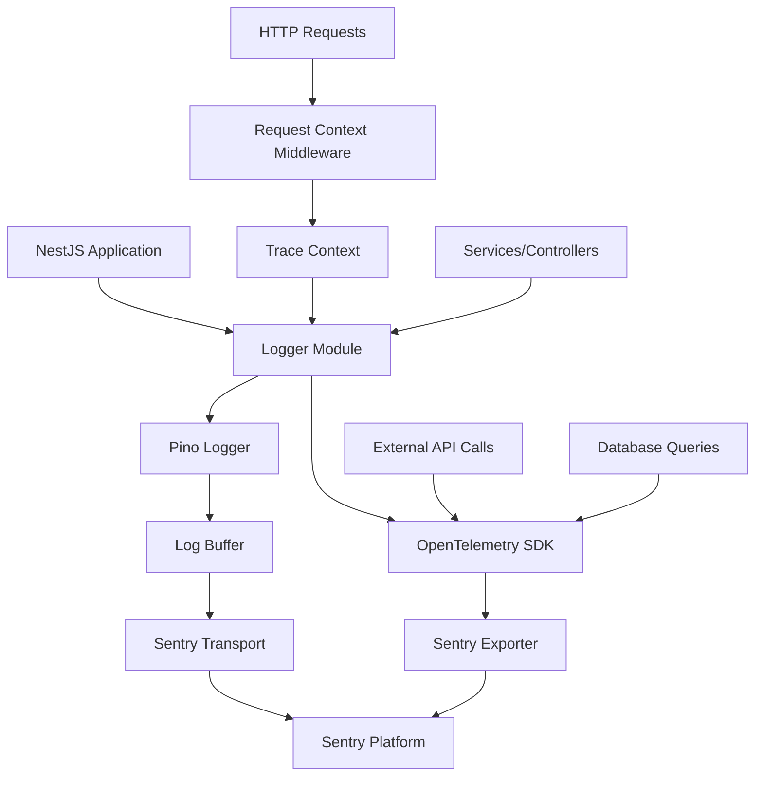

# Design Document

## Overview

This design implements a comprehensive observability solution for the AIR Discovery backend using Pino.js for structured async logging, Sentry for error tracking and log aggregation, and OpenTelemetry as a vendor-agnostic instrumentation layer. The solution replaces all console.log statements with structured logging, implements buffered log transmission to reduce overhead, and provides contextual tracing across all operations.

### Key Design Principles

1. **Performance First**: Async logging with buffering to minimize impact on request processing
2. **Vendor Agnostic**: OpenTelemetry abstraction enables future migration to alternative monitoring tools
3. **Context Propagation**: Request IDs and trace context flow through all operations
4. **Privacy Compliant**: Automatic redaction of sensitive data (PII, payment info, credentials)
5. **Environment Aware**: Different log levels and behaviors for development vs production

## Architecture

### High-Level Architecture



### Component Layers

1. **Application Layer**: NestJS controllers and services
2. **Instrumentation Layer**: OpenTelemetry SDK with auto-instrumentation
3. **Logging Layer**: Pino logger with custom transports
4. **Transport Layer**: Buffered Sentry transport
5. **Observability Platform**: Sentry (replaceable via OpenTelemetry config)

## Components and Interfaces

### 1. Logger Module (`src/modules/logger/`)

A global NestJS module that provides logging services throughout the application.

**Files:**
- `logger.module.ts` - Module definition with global scope
- `logger.service.ts` - Wrapper around Pino with NestJS integration
- `logger.config.ts` - Configuration factory for Pino options
- `transports/sentry.transport.ts` - Custom Pino transport for Sentry
- `utils/redaction.util.ts` - Sensitive data redaction logic

**LoggerService Interface:**
```typescript
interface LoggerService {
  debug(message: string, context?: LogContext): void;
  info(message: string, context?: LogContext): void;
  warn(message: string, context?: LogContext): void;
  error(message: string, error?: Error, context?: LogContext): void;
  fatal(message: string, error?: Error, context?: LogContext): void;
  
  // Child logger with bound context
  child(context: LogContext): LoggerService;
  
  // Flush buffered logs (for graceful shutdown)
  flush(): Promise<void>;
}

interface LogContext {
  requestId?: string;
  userId?: string;
  sessionId?: string;
  bookingId?: string;
  module?: string;
  function?: string;
  [key: string]: any;
}
```

### 2. OpenTelemetry Module (`src/modules/telemetry/`)

Handles OpenTelemetry SDK initialization and configuration.

**Files:**
- `telemetry.module.ts` - Module definition
- `telemetry.service.ts` - OpenTelemetry SDK initialization
- `telemetry.config.ts` - Configuration for exporters and instrumentation
- `instrumentations/` - Custom instrumentation for NestJS-specific operations

**TelemetryService Interface:**
```typescript
interface TelemetryService {
  // Initialize OpenTelemetry SDK
  initialize(): Promise<void>;
  
  // Get tracer for manual instrumentation
  getTracer(name: string): Tracer;
  
  // Create span for operation
  startSpan(name: string, options?: SpanOptions): Span;
  
  // Graceful shutdown
  shutdown(): Promise<void>;
}
```

### 3. Request Context Middleware (`src/common/middlewares/request-context.middleware.ts`)

Generates unique request IDs and propagates trace context.

**Responsibilities:**
- Generate UUID for each incoming request
- Extract or create trace context from headers
- Store context in AsyncLocalStorage for access throughout request lifecycle
- Inject request ID into response headers

**Interface:**
```typescript
interface RequestContext {
  requestId: string;
  traceId: string;
  spanId: string;
  userId?: string;
  timestamp: Date;
}
```

### 4. Sentry Transport (`src/modules/logger/transports/sentry.transport.ts`)

Custom Pino transport that buffers logs and sends them to Sentry.

**Features:**
- In-memory buffer with configurable size (default: 50 entries)
- Time-based flushing (default: 30 seconds)
- Retry logic with exponential backoff (max 3 attempts)
- Graceful shutdown with buffer flush
- Error-level logs sent immediately (no buffering)

**Configuration:**
```typescript
interface SentryTransportConfig {
  dsn: string;
  environment: string;
  bufferSize: number;
  flushInterval: number;
  maxRetries: number;
  retryDelay: number;
}
```

### 5. Redaction Utility (`src/modules/logger/utils/redaction.util.ts`)

Automatically redacts sensitive data from log entries.

**Redacted Fields:**
- Payment: `cardNumber`, `cvv`, `cardDetails`, `paymentMethod`
- Auth: `password`, `token`, `accessToken`, `refreshToken`, `secret`, `apiKey`
- PII (production only): `email`, `phone`, `phoneNumber`, `ssn`

**Interface:**
```typescript
interface RedactionUtil {
  redact(data: any, environment: string): any;
  addRedactionPattern(pattern: string | RegExp): void;
}
```

### 6. Logger Interceptor (`src/common/interceptors/logger.interceptor.ts`)

NestJS interceptor that automatically logs HTTP requests and responses.

**Logged Information:**
- Request: method, URL, headers (filtered), body (redacted), query params
- Response: status code, duration, body size
- Errors: full error details with stack trace

## Data Models

### Log Entry Structure

```typescript
interface LogEntry {
  // Standard fields
  timestamp: string;          // ISO 8601
  level: LogLevel;            // debug | info | warn | error | fatal
  message: string;
  
  // Context fields
  requestId?: string;
  traceId?: string;
  spanId?: string;
  userId?: string;
  sessionId?: string;
  
  // Module context
  module?: string;
  function?: string;
  
  // Error details (if applicable)
  error?: {
    name: string;
    message: string;
    stack: string;
    code?: string;
  };
  
  // Business context
  context?: Record<string, any>;
  
  // Performance metrics
  duration?: number;          // milliseconds
  
  // Environment
  environment: string;
  service: string;
  version: string;
}
```

### Trace Context

```typescript
interface TraceContext {
  traceId: string;           // W3C Trace Context format
  spanId: string;
  parentSpanId?: string;
  traceFlags: number;
  traceState?: string;
}
```

## Integration Points

### 1. Application Bootstrap (`src/main.ts`)

```typescript
async function bootstrap() {
  // Initialize OpenTelemetry FIRST (before NestJS app creation)
  const telemetryService = new TelemetryService();
  await telemetryService.initialize();
  
  const app = await NestFactory.create(AppModule, {
    logger: false, // Disable default NestJS logger
  });
  
  // Get custom logger from DI container
  const logger = app.get(LoggerService);
  app.useLogger(logger);
  
  // Apply request context middleware
  app.use(RequestContextMiddleware);
  
  // Apply logger interceptor globally
  app.useGlobalInterceptors(new LoggerInterceptor(logger));
  
  // Graceful shutdown
  process.on('SIGTERM', async () => {
    await logger.flush();
    await telemetryService.shutdown();
    await app.close();
  });
  
  await app.listen(process.env.PORT ?? 3001);
  logger.info('Application started', { port: process.env.PORT ?? 3001 });
}
```

### 2. Module Integration

Each existing module will be updated to inject and use LoggerService:

```typescript
@Injectable()
export class ChatbotService {
  private readonly logger: LoggerService;
  
  constructor(
    private readonly loggerService: LoggerService,
    // ... other dependencies
  ) {
    // Create child logger with module context
    this.logger = loggerService.child({ module: 'ChatbotService' });
  }
  
  async processMessage(sessionId: string, message: string) {
    this.logger.info('Processing chatbot message', {
      sessionId,
      messageLength: message.length,
      function: 'processMessage'
    });
    
    try {
      // ... business logic
      this.logger.debug('Message processed successfully', { sessionId });
    } catch (error) {
      this.logger.error('Failed to process message', error, { sessionId });
      throw error;
    }
  }
}
```

### 3. External API Instrumentation

OpenTelemetry will automatically instrument:
- HTTP/HTTPS requests (Amadeus API, Stripe API)
- PostgreSQL queries (via TypeORM)
- Redis operations (via ioredis)
- AWS SDK calls (Bedrock, SES, Cognito, DynamoDB)

Manual instrumentation for custom operations:

```typescript
@Injectable()
export class AmadeusClientService {
  constructor(
    private readonly logger: LoggerService,
    private readonly telemetry: TelemetryService,
  ) {}
  
  async searchFlights(params: FlightSearchParams) {
    const tracer = this.telemetry.getTracer('amadeus-client');
    const span = tracer.startSpan('amadeus.searchFlights');
    
    try {
      this.logger.info('Searching flights', { params });
      const response = await this.httpClient.post('/flights', params);
      
      span.setAttributes({
        'amadeus.origin': params.origin,
        'amadeus.destination': params.destination,
        'amadeus.results': response.data.length,
      });
      
      this.logger.info('Flight search completed', {
        resultCount: response.data.length,
        duration: span.duration,
      });
      
      return response.data;
    } catch (error) {
      span.recordException(error);
      this.logger.error('Flight search failed', error, { params });
      throw error;
    } finally {
      span.end();
    }
  }
}
```

## Configuration

### Environment Variables

```bash
# Logging
LOG_LEVEL=info                          # debug | info | warn | error | fatal
LOG_PRETTY=false                        # Pretty print for development
LOG_REDACT_PII=true                     # Redact PII in production

# Sentry
SENTRY_DSN=https://xxx@sentry.io/xxx
SENTRY_ENVIRONMENT=production           # development | staging | production
SENTRY_TRACES_SAMPLE_RATE=0.1          # 10% of transactions
SENTRY_BUFFER_SIZE=50
SENTRY_FLUSH_INTERVAL=30000            # milliseconds

# OpenTelemetry
OTEL_SERVICE_NAME=airdiscovery-backend
OTEL_SERVICE_VERSION=0.0.1
OTEL_EXPORTER_TYPE=sentry              # sentry | jaeger | zipkin | otlp
```

### Pino Configuration

```typescript
export const pinoConfig: LoggerOptions = {
  level: process.env.LOG_LEVEL || 'info',
  
  // Pretty print in development
  transport: process.env.LOG_PRETTY === 'true' ? {
    target: 'pino-pretty',
    options: {
      colorize: true,
      translateTime: 'SYS:standard',
      ignore: 'pid,hostname',
    }
  } : undefined,
  
  // Base fields
  base: {
    service: process.env.OTEL_SERVICE_NAME,
    version: process.env.OTEL_SERVICE_VERSION,
    environment: process.env.SENTRY_ENVIRONMENT,
  },
  
  // Timestamp format
  timestamp: () => `,"timestamp":"${new Date().toISOString()}"`,
  
  // Redaction
  redact: {
    paths: [
      'password',
      'token',
      'accessToken',
      'refreshToken',
      'secret',
      'apiKey',
      'cardNumber',
      'cvv',
      '*.password',
      '*.token',
      '*.cardNumber',
    ],
    censor: '[REDACTED]',
  },
};
```

## Error Handling

### Error Classification

1. **Application Errors**: Business logic errors (validation, not found, etc.)
   - Log level: `warn` or `error`
   - Sent to Sentry with context
   - Include user-facing error message

2. **System Errors**: Infrastructure failures (DB connection, API timeout)
   - Log level: `error` or `fatal`
   - Sent to Sentry immediately (no buffering)
   - Include full stack trace and system context

3. **External API Errors**: Third-party service failures
   - Log level: `error`
   - Include request/response details (redacted)
   - Track error rates per service

### Error Context

All errors logged with:
- Error name, message, stack trace
- Request context (ID, user, session)
- Operation context (module, function, parameters)
- Timing information (when error occurred, operation duration)

### Sentry Error Grouping

Errors grouped by:
- Error type/class
- Error message (normalized)
- Stack trace fingerprint
- Module/function where error occurred

## Testing Strategy

### Unit Tests

1. **LoggerService Tests** (`logger.service.spec.ts`)
   - Test all log levels (debug, info, warn, error, fatal)
   - Verify context propagation
   - Test child logger creation
   - Verify flush behavior

2. **Sentry Transport Tests** (`sentry.transport.spec.ts`)
   - Test buffering logic (size and time triggers)
   - Verify retry mechanism with exponential backoff
   - Test immediate sending for error-level logs
   - Test graceful shutdown with buffer flush

3. **Redaction Utility Tests** (`redaction.util.spec.ts`)
   - Verify all sensitive fields are redacted
   - Test nested object redaction
   - Test array redaction
   - Verify environment-specific redaction (PII in production only)

4. **Request Context Middleware Tests** (`request-context.middleware.spec.ts`)
   - Verify request ID generation
   - Test trace context extraction from headers
   - Verify context storage in AsyncLocalStorage
   - Test response header injection

### Integration Tests

1. **End-to-End Logging Flow** (`logger-integration.spec.ts`)
   - Create request → verify log entry with request ID
   - Trigger error → verify error sent to Sentry
   - Multiple concurrent requests → verify context isolation

2. **OpenTelemetry Integration** (`telemetry-integration.spec.ts`)
   - Verify trace context propagation
   - Test automatic instrumentation (HTTP, DB, Redis)
   - Verify span creation and attributes

3. **Console.log Migration** (`console-migration.spec.ts`)
   - Scan codebase for remaining console.log statements
   - Verify all modules use LoggerService

### Performance Tests

1. **Logging Overhead** (`logger-performance.spec.ts`)
   - Measure latency impact of logging on request processing
   - Target: < 1ms overhead per log entry
   - Verify async behavior (non-blocking)

2. **Buffer Performance** (`buffer-performance.spec.ts`)
   - Test buffer behavior under high load
   - Verify no memory leaks
   - Test flush performance

## Migration Strategy

### Phase 1: Infrastructure Setup
1. Install dependencies (pino, @sentry/node, @opentelemetry/*)
2. Create logger module and service
3. Create telemetry module and service
4. Configure Sentry transport
5. Add environment variables

### Phase 2: Core Integration
1. Update main.ts to initialize telemetry and logger
2. Add request context middleware
3. Add logger interceptor
4. Update app.module.ts to import logger module globally

### Phase 3: Console.log Replacement
1. Update each service/controller to inject LoggerService
2. Replace console.log with appropriate log level
3. Add contextual information to log calls
4. Remove debug middleware from main.ts

### Phase 4: Testing & Validation
1. Run unit tests
2. Run integration tests
3. Manual testing in development environment
4. Verify logs appear in Sentry dashboard
5. Verify trace context propagation

### Console.log Migration Checklist

Based on grep search, the following files need updates:

- `src/modules/destinations/destinations.service.ts` (1 occurrence)
- `src/modules/chatbot/utils/json-response-parser.ts` (10 occurrences)
- `src/modules/chatbot/chatbot.service.ts` (1 occurrence)
- `src/modules/chatbot/chatbot.gateway.ts` (2 occurrences)
- `src/main.ts` (8 occurrences - debug middleware)

Total: ~22 console.log statements to replace

## Dependencies

### New Dependencies

```json
{
  "dependencies": {
    "pino": "^9.0.0",
    "pino-pretty": "^11.0.0",
    "@sentry/node": "^8.0.0",
    "@sentry/profiling-node": "^8.0.0",
    "@opentelemetry/api": "^1.9.0",
    "@opentelemetry/sdk-node": "^0.52.0",
    "@opentelemetry/auto-instrumentations-node": "^0.48.0",
    "@opentelemetry/exporter-trace-otlp-http": "^0.52.0",
    "@opentelemetry/instrumentation-http": "^0.52.0",
    "@opentelemetry/instrumentation-nestjs-core": "^0.39.0"
  },
  "devDependencies": {
    "@types/pino": "^7.0.0"
  }
}
```

## Performance Considerations

1. **Async Logging**: Pino writes to stdout asynchronously, preventing I/O blocking
2. **Buffering**: Batching logs reduces network overhead (50 logs vs 50 individual requests)
3. **Sampling**: Trace sampling (10%) reduces data volume while maintaining visibility
4. **Lazy Evaluation**: Log context objects only serialized if log level is enabled
5. **Memory Management**: Buffer size limits prevent memory exhaustion under high load

## Security Considerations

1. **Data Redaction**: Automatic removal of sensitive data before transmission
2. **Environment Separation**: Different Sentry projects for dev/staging/production
3. **Access Control**: Sentry DSN stored in environment variables, not code
4. **TLS**: All communication with Sentry over HTTPS
5. **PII Compliance**: Configurable PII redaction for GDPR/CCPA compliance

## Monitoring & Alerts

### Sentry Dashboard Views

1. **Error Tracking**: Real-time error feed with grouping and trends
2. **Performance Monitoring**: Transaction traces with operation breakdown
3. **Log Explorer**: Searchable log entries with filtering
4. **Release Tracking**: Error rates per deployment version

### Recommended Alerts

1. **High Error Rate**: > 10 errors/minute
2. **Critical Errors**: Any fatal-level log
3. **API Failures**: External API error rate > 5%
4. **Performance Degradation**: P95 latency > 2 seconds
5. **Log Buffer Overflow**: Buffer flush failures

## Future Enhancements

1. **Metrics Collection**: Add OpenTelemetry metrics for business KPIs
2. **Distributed Tracing**: Trace requests across frontend → backend → external APIs
3. **Log Aggregation**: Add Elasticsearch for long-term log storage and analysis
4. **Custom Dashboards**: Build Grafana dashboards for operational metrics
5. **Anomaly Detection**: ML-based alerting for unusual patterns
