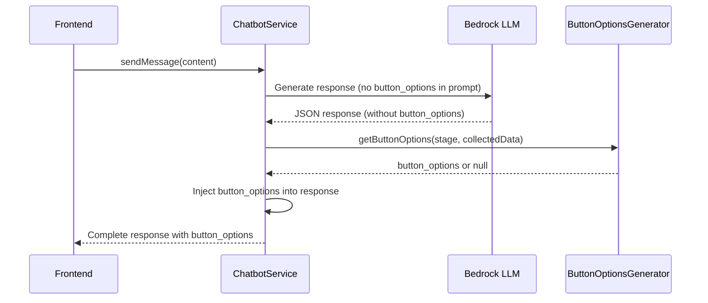

# Design Document

## Overview

This design moves button_options generation from the LLM to a static backend utility. The LLM prompt will be simplified to remove all button_options references, and a new `ButtonOptionsGenerator` utility will be created to generate button options based on conversation state. The ChatbotService will inject these options into responses before sending them to the frontend.

## Architecture



## Components and Interfaces

### ButtonOptionsGenerator Utility

New file: `backend/airdiscovery/src/modules/chatbot/utils/button-options-generator.ts`

```typescript
export interface ButtonOption {
  readonly label: string;
  readonly value: string;
}

export const PASSENGER_BUTTON_OPTIONS = {
  adults: [
    { label: '1 adulto', value: '1' },
    { label: '2 adultos', value: '2' },
    { label: '3 adultos', value: '3' },
    { label: '4 adultos', value: '4' },
  ] as readonly ButtonOption[],
  
  children: [
    { label: 'Nenhuma', value: '0' },
    { label: '1 criança', value: '1' },
    { label: '2 crianças', value: '2' },
    { label: '3 crianças', value: '3' },
  ] as readonly ButtonOption[],
} as const;

export function getButtonOptionsForStage(
  stage: ConversationStage,
  collectedData: CollectedData
): readonly ButtonOption[] | null;
```

### Modified JsonPromptBuilder

Remove from `json-prompt-builder.ts`:
- `button_options` from JSON schema
- Instructions about generating button_options
- `button_options` from all example responses
- References to "COM BOTÕES" in interview flow

### Modified ChatbotService

Update `processCompleteResponse` method to:
1. Parse LLM response (without button_options)
2. Call `ButtonOptionsGenerator.getButtonOptionsForStage()`
3. Inject button_options into the response if not null
4. Send complete response to frontend

### Modified Interfaces

Update `json-response.interface.ts`:
- Keep `button_options` in `ChatbotJsonResponse` (for frontend compatibility)
- Remove from LLM-related validation

## Data Models

### ButtonOption (unchanged)
```typescript
interface ButtonOption {
  label: string;  // Display text
  value: string;  // Value sent when clicked
}
```

### Response Flow
```
LLM Response (no button_options)
    ↓
ButtonOptionsGenerator.getButtonOptionsForStage()
    ↓
Inject into response
    ↓
Frontend receives complete response with button_options
```

## Error Handling

1. **LLM still includes button_options**: Ignore any button_options from LLM, use generated ones
2. **Invalid stage**: Return null (no buttons)
3. **Missing collectedData**: Return appropriate buttons based on available data

## Testing Strategy

### Unit Tests

1. **ButtonOptionsGenerator tests** (`button-options-generator.spec.ts`):
   - Returns adult options when stage is collecting_passengers and no adults
   - Returns children options when adults collected but no children
   - Returns null for other stages
   - Returns null when all passenger data collected

2. **JsonPromptBuilder tests** (update existing):
   - Verify button_options NOT in prompt
   - Verify button_options NOT in examples
   - Verify no "COM BOTÕES" instructions

3. **ChatbotService tests** (update existing):
   - Verify button_options injected correctly
   - Verify LLM button_options ignored

### Integration Tests

1. End-to-end flow with passenger collection
2. Verify frontend receives correct button_options
