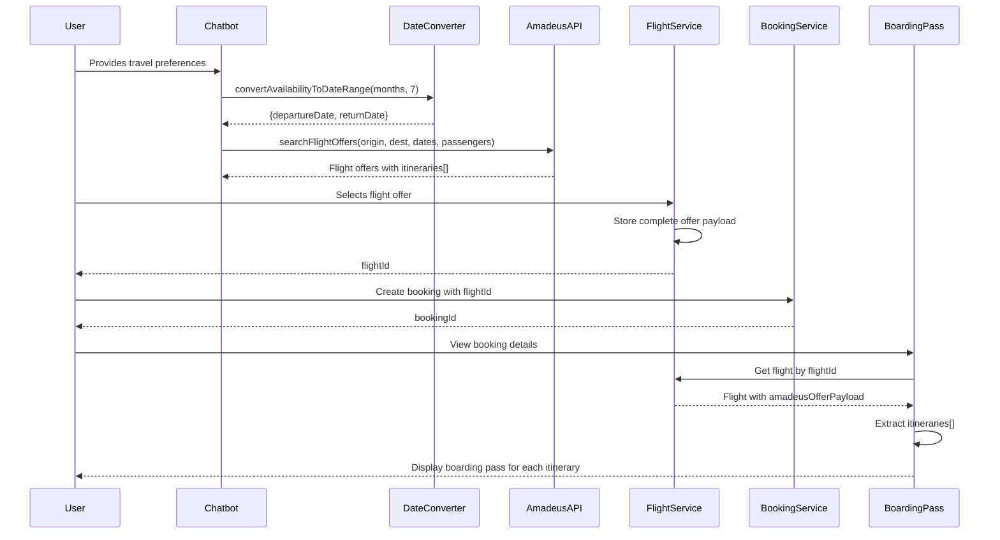

# Design Document - Round-Trip Flight Support

## Overview

This document describes the technical design for round-trip flight functionality in the AIR Discovery platform. The system already implements round-trip flight support with a default 7-day return window. This design validates the existing implementation and documents how data flows from the chatbot through flight search, selection, booking, and final boarding pass generation.

## Architecture

### High-Level Flow

```
┌─────────────┐
│   Chatbot   │ Collects: origin, destination, availability_months, passengers
└──────┬──────┘
       │
       ▼
┌─────────────────────────────┐
│ convertAvailabilityToDateRange │ Calculates: departureDate, returnDate (+7 days)
└──────┬──────────────────────┘
       │
       ▼
┌─────────────────┐
│  Amadeus API    │ Searches: round-trip flights with returnDate
└──────┬──────────┘
       │
       ▼
┌─────────────────┐
│ Flight Entity   │ Stores: complete offer payload with all itineraries
└──────┬──────────┘
       │
       ▼
┌─────────────────┐
│ Booking Entity  │ References: Flight entity
└──────┬──────────┘
       │
       ▼
┌─────────────────────┐
│ Boarding Pass Cards │ Displays: separate card for each itinerary
└─────────────────────┘
```

### Component Interaction



## Components and Interfaces

### 1. Date Conversion Utility

**Location:** `backend/airdiscovery/src/modules/chatbot/utils/date-converter.util.ts`

**Purpose:** Converts availability months into specific departure and return dates for flight search.

**Key Function:**
```typescript
export function convertAvailabilityToDateRange(
  availabilityMonths: readonly string[] | string[] | null | undefined,
  tripDuration: number = 7
): DateRange {
  // Returns: { departureDate: 'YYYY-MM-DD', returnDate: 'YYYY-MM-DD' }
}
```

**Logic:**
1. If no months provided: Use 30 days from now as departure, +7 days as return
2. If months provided: Use 15th of first available month as departure, +7 days as return
3. If month has already passed in current year: Use next year
4. Ensure minimum 14 days advance booking

**Example Outputs:**
- Input: `['Janeiro']` (in November 2025) → `{departureDate: '2026-01-15', returnDate: '2026-01-22'}`
- Input: `['Dezembro']` (in November 2025) → `{departureDate: '2025-12-15', returnDate: '2025-12-22'}`
- Input: `null` → `{departureDate: '2025-12-12', returnDate: '2025-12-19'}` (30 days from now)

### 2. Chatbot Service

**Location:** `backend/airdiscovery/src/modules/chatbot/chatbot.service.ts`

**Purpose:** Orchestrates the chat flow and prepares flight search parameters.

**Key Method:**
```typescript
async getFlightSearchParamsFromSession(
  sessionId: string,
  tripDuration: number = 7
): Promise<FlightSearchParams | null>
```

**Responsibilities:**
- Retrieve collected data from chat session
- Validate minimum required data (origin_iata, destination_iata)
- Convert availability_months to date range using `convertAvailabilityToDateRange`
- Extract passenger composition (adults, children)
- Validate passenger counts using `PassengerValidationUtil`
- Return complete search parameters including returnDate

**Output Structure:**
```typescript
{
  originLocationCode: string;      // e.g., 'GRU'
  destinationLocationCode: string; // e.g., 'REC'
  departureDate: string;           // e.g., '2026-01-15'
  returnDate: string;              // e.g., '2026-01-22'
  adults: number;                  // e.g., 2
  children?: number;               // e.g., 1 (optional)
}
```

### 3. Amadeus Client Service

**Location:** `backend/airdiscovery/src/common/amadeus/amadeus-client.service.ts`

**Purpose:** Interfaces with Amadeus Flight Offers Search API.

**Key Method:**
```typescript
async searchFlightOffers(params: {
  originLocationCode: string;
  destinationLocationCode: string;
  departureDate: string;
  returnDate?: string;  // ← Round-trip indicator
  adults: number;
  children?: number;
  infants?: number;
  nonStop?: boolean;
  max?: number;
}): Promise<AmadeusFlightSearchResponse>
```

**Round-Trip Handling:**
- If `returnDate` is provided, Amadeus returns offers with 2 itineraries
- Itinerary[0] = Outbound flight (origin → destination)
- Itinerary[1] = Return flight (destination → origin)
- Each itinerary contains one or more segments (for connections)

**Response Structure:**
```typescript
{
  meta: { count: number },
  data: [
    {
      id: string,
      itineraries: [
        {
          duration: string,
          segments: [
            {
              departure: { iataCode: string, at: string },
              arrival: { iataCode: string, at: string },
              carrierCode: string,
              number: string
            }
          ]
        },
        // Second itinerary for return flight
        { ... }
      ],
      price: {
        total: string,
        currency: string
      }
    }
  ]
}
```

### 4. Flight Entity and Service

**Location:** `backend/airdiscovery/src/modules/flights/`

**Purpose:** Persists flight data for booking reference.

**Entity Schema:**
```typescript
@Entity('flights')
export class Flight {
  @PrimaryGeneratedColumn('uuid')
  id: string;

  @Column()
  amadeusOfferId: string;

  @Column({ type: 'jsonb' })
  amadeusOfferPayload: any;  // ← Stores complete offer with all itineraries

  @Column()
  flightNumber: string;  // From first segment of first itinerary

  @Column()
  departureCode: string;  // From first itinerary

  @Column()
  arrivalCode: string;  // From first itinerary

  @Column()
  departureDateTime: Date;

  @Column()
  arrivalDateTime: Date;

  @Column('decimal')
  priceTotal: number;

  @Column()
  currency: string;
}
```

**Key Method:**
```typescript
async createFlightFromOffer(dto: CreateFlightFromOfferDto): Promise<Flight> {
  // Stores complete Amadeus offer payload
  // Extracts summary data from first itinerary for quick reference
  // Returns Flight entity with internal UUID
}
```

**Design Decision:** Store the complete Amadeus payload to preserve all itinerary data, even though summary fields only reflect the first itinerary. This allows full reconstruction of round-trip details later.

### 5. Recommendations Page

**Location:** `app/src/pages/RecommendationsPage.tsx`

**Purpose:** Displays flight search results to users.

**Key Features:**
- Accepts `returnDate` from URL query parameters
- Passes returnDate to `useFlightSearch` hook
- Displays all itineraries from each flight offer
- Shows total price for complete round-trip

**Display Logic:**
```typescript
{flightOffers.map((offer) => (
  <Card>
    {/* Display offer details */}
    {offer.itineraries.map((itinerary, index) => (
      <Box>
        {/* Show departure/arrival for this leg */}
        {/* Show duration and stops */}
        {/* Label: index === 0 ? "Outbound" : "Return" */}
      </Box>
    ))}
    {/* Show total price for complete trip */}
  </Card>
))}
```

### 6. Checkout Page

**Location:** `app/src/pages/CheckoutPage.tsx`

**Purpose:** Guides user through booking process.

**Round-Trip Handling:**
- Retrieves Flight entity by flightId
- Extracts `amadeusOfferPayload` from Flight
- Passes complete offer to FlightSummary component
- FlightSummary displays both itineraries in sidebar
- PriceSummary shows total price for round-trip

**Data Flow:**
```typescript
const { flight } = useFlight(flightId);
const flightOffer = flight?.amadeusOfferPayload as AmadeusFlightOffer;

// flightOffer.itineraries contains both outbound and return
```

### 7. Booking Detail Page

**Location:** `app/src/pages/BookingDetailPage.tsx`

**Purpose:** Displays confirmed booking with boarding passes.

**Itinerary Extraction:**
```typescript
const flightItineraries = useMemo(() => {
  if (!flight?.amadeusOfferPayload) return [];
  
  const offer = flight.amadeusOfferPayload as AmadeusFlightOffer;
  
  // Map each itinerary to boarding pass data
  return offer.itineraries.map((itinerary, index) => {
    const firstSegment = itinerary.segments[0];
    const lastSegment = itinerary.segments[itinerary.segments.length - 1];
    
    return {
      flightNumber: `${firstSegment.carrierCode}-${firstSegment.number}`,
      departureCode: firstSegment.departure.iataCode,
      arrivalCode: lastSegment.arrival.iataCode,
      departureDateTime: firstSegment.departure.at,
      arrivalDateTime: lastSegment.arrival.at,
      airline: firstSegment.carrierCode,
      itineraryIndex: index,
    };
  });
}, [flight]);
```

**Boarding Pass Display:**
```typescript
{flightItineraries.map((itinerary, index) => (
  <Box key={index}>
    {flightItineraries.length > 1 && (
      <Typography variant="h5">
        {index === 0 ? '✈️ Voo de Ida' : '✈️ Voo de Volta'}
      </Typography>
    )}
    <BoardingPassCard 
      booking={booking}
      flight={itinerary}
    />
  </Box>
))}
```

### 8. Boarding Pass Card

**Location:** `app/src/components/booking/BoardingPassCard.tsx`

**Purpose:** Renders a single boarding pass for one itinerary.

**Props:**
```typescript
interface BoardingPassCardProps {
  booking: BookingResponseDto;  // For passenger list and locator
  flight: FlightDetails;        // For this specific itinerary
}

interface FlightDetails {
  flightNumber: string;
  departureCode: string;
  arrivalCode: string;
  departureDateTime: string;
  arrivalDateTime: string;
  airline?: string;
}
```

**Design:** Each boarding pass is self-contained and displays:
- Flight route (departure → arrival)
- Flight number and airline
- Departure/arrival times and date
- Booking locator (same for all passes in a booking)
- Passenger list (same for all passes in a booking)
- QR code for check-in

## Data Models

### CollectedTravelData (Chat Session)

```typescript
interface CollectedTravelData {
  origin_name: string | null;
  origin_iata: string | null;
  destination_name: string | null;
  destination_iata: string | null;
  activities: readonly string[] | null;
  budget_in_brl: number | null;
  availability_months: readonly string[] | null;  // ← Used for date calculation
  purpose: string | null;
  hobbies: readonly string[] | null;
  passenger_composition: PassengerComposition | null;
}
```

### DateRange (Calculated)

```typescript
interface DateRange {
  departureDate: string;  // YYYY-MM-DD
  returnDate: string;     // YYYY-MM-DD (departureDate + 7 days)
}
```

### AmadeusFlightOffer (API Response)

```typescript
interface AmadeusFlightOffer {
  id: string;
  itineraries: AmadeusItinerary[];  // ← 2 items for round-trip
  price: {
    total: string;
    currency: string;
  };
  // ... other fields
}

interface AmadeusItinerary {
  duration: string;
  segments: AmadeusSegment[];  // ← May have multiple for connections
}

interface AmadeusSegment {
  departure: {
    iataCode: string;
    at: string;  // ISO datetime
  };
  arrival: {
    iataCode: string;
    at: string;
  };
  carrierCode: string;
  number: string;
  // ... other fields
}
```

### Flight Entity (Database)

```typescript
{
  id: UUID;
  amadeusOfferId: string;
  amadeusOfferPayload: JSONB;  // ← Complete offer with itineraries[]
  flightNumber: string;        // Summary from first itinerary
  departureCode: string;
  arrivalCode: string;
  departureDateTime: Date;
  arrivalDateTime: Date;
  priceTotal: Decimal;
  currency: string;
}
```

### Booking Entity (Database)

```typescript
{
  booking_id: UUID;
  customer: Customer;
  flight: Flight;              // ← References Flight with round-trip data
  passengers: Passenger[];
  total_amount: Decimal;
  status: BookingStatus;
  // ... other fields
}
```

## Error Handling

### Date Calculation Errors

**Scenario:** Invalid or missing availability months

**Handling:**
```typescript
// In convertAvailabilityToDateRange
if (!availabilityMonths || availabilityMonths.length === 0) {
  // Fallback: 30 days from now + 7 days return
  const departureDate = new Date(now);
  departureDate.setDate(departureDate.getDate() + 30);
  
  const returnDate = new Date(departureDate);
  returnDate.setDate(returnDate.getDate() + tripDuration);
  
  return { departureDate, returnDate };
}
```

### Amadeus API Errors

**Scenario:** No flights found for round-trip dates

**Handling:**
```typescript
// In AmadeusClientService
if (!response.ok) {
  const errorData = await response.json();
  
  // Map to user-friendly message
  if (errorData.errors?.[0]?.code === 'NO_FLIGHTS_FOUND') {
    throw new HttpException(
      'Nenhum voo encontrado para as datas selecionadas. Tente outras datas.',
      HttpStatus.NOT_FOUND
    );
  }
}
```

### Missing Itinerary Data

**Scenario:** Flight entity missing itinerary data in payload

**Handling:**
```typescript
// In BookingDetailPage
const flightItineraries = useMemo(() => {
  if (!flight?.amadeusOfferPayload) return [];
  
  const offer = flight.amadeusOfferPayload as AmadeusFlightOffer;
  
  if (!offer.itineraries || offer.itineraries.length === 0) {
    console.error('No itineraries found in flight offer');
    return [];
  }
  
  return offer.itineraries.map(...);
}, [flight]);

// In render
{flightItineraries.length === 0 && (
  <Alert severity="warning">
    Dados do voo não disponíveis
  </Alert>
)}
```

### Invalid Date Ranges

**Scenario:** Return date before departure date

**Handling:**
```typescript
// In DestinationsService
if (queryDTO.returnDate) {
  const returnDate = new Date(queryDTO.returnDate);
  const departureDate = new Date(queryDTO.departureDate);
  
  if (returnDate < departureDate) {
    throw new HttpException(
      'A data de retorno não pode ser anterior à data de partida',
      HttpStatus.BAD_REQUEST
    );
  }
}
```

## Testing Strategy

### Unit Tests

**Date Converter Tests:**
```typescript
describe('convertAvailabilityToDateRange', () => {
  it('should use 7-day default duration', () => {
    const result = convertAvailabilityToDateRange(['Janeiro'], 7);
    const departure = new Date(result.departureDate);
    const returnDate = new Date(result.returnDate);
    const diff = (returnDate - departure) / (1000 * 60 * 60 * 24);
    expect(diff).toBe(7);
  });

  it('should handle null months with 30-day advance', () => {
    const result = convertAvailabilityToDateRange(null, 7);
    expect(result.departureDate).toBeDefined();
    expect(result.returnDate).toBeDefined();
  });

  it('should use next year for past months', () => {
    // If current month is November
    const result = convertAvailabilityToDateRange(['Janeiro'], 7);
    expect(result.departureDate).toContain('2026-01');
  });
});
```

**Chatbot Service Tests:**
```typescript
describe('getFlightSearchParamsFromSession', () => {
  it('should include returnDate in search params', async () => {
    const params = await service.getFlightSearchParamsFromSession(sessionId);
    expect(params.returnDate).toBeDefined();
    expect(params.returnDate).toMatch(/^\d{4}-\d{2}-\d{2}$/);
  });

  it('should calculate returnDate as departureDate + 7 days', async () => {
    const params = await service.getFlightSearchParamsFromSession(sessionId);
    const departure = new Date(params.departureDate);
    const returnDate = new Date(params.returnDate);
    const diff = (returnDate - departure) / (1000 * 60 * 60 * 24);
    expect(diff).toBe(7);
  });
});
```

### Integration Tests

**Flight Search Flow:**
```typescript
describe('Round-trip flight search', () => {
  it('should search Amadeus with returnDate parameter', async () => {
    const response = await request(app.getHttpServer())
      .get('/destinations')
      .query({
        origin: 'GRU',
        destination: 'REC',
        departureDate: '2026-01-15',
        returnDate: '2026-01-22',
        adults: 2
      });
    
    expect(response.status).toBe(200);
    expect(response.body.data[0].itineraries).toHaveLength(2);
  });
});
```

**Booking Detail Display:**
```typescript
describe('BookingDetailPage', () => {
  it('should display separate boarding passes for round-trip', () => {
    render(<BookingDetailPage />);
    
    expect(screen.getByText('✈️ Voo de Ida')).toBeInTheDocument();
    expect(screen.getByText('✈️ Voo de Volta')).toBeInTheDocument();
    expect(screen.getAllByTestId('boarding-pass-card')).toHaveLength(2);
  });
});
```

### E2E Tests

**Complete Round-Trip Booking Flow:**
```typescript
describe('Round-trip booking E2E', () => {
  it('should complete full booking with round-trip flights', async () => {
    // 1. Chat collects preferences
    await chatbot.sendMessage('Quero viajar de São Paulo para Recife');
    await chatbot.sendMessage('Tenho R$ 3000');
    await chatbot.sendMessage('2 adultos');
    await chatbot.sendMessage('Janeiro');
    await chatbot.sendMessage('Praia');
    await chatbot.sendMessage('Lazer');
    
    // 2. View recommendations
    await page.click('[data-testid="view-flights-button"]');
    expect(page.url()).toContain('/recommendations');
    expect(page.url()).toContain('returnDate=');
    
    // 3. Select flight
    await page.click('[data-testid="select-flight-button"]');
    
    // 4. Complete checkout
    await fillPassengerForm();
    await page.click('[data-testid="confirm-button"]');
    await completePayment();
    
    // 5. View boarding passes
    expect(await page.textContent('h5')).toContain('Voo de Ida');
    expect(await page.textContent('h5')).toContain('Voo de Volta');
  });
});
```

## Performance Considerations

### Database Query Optimization

- Flight entity stores complete payload in JSONB for efficient retrieval
- No need for separate Itinerary table since data is read-only after creation
- Index on `amadeusOfferId` for deduplication checks

### Frontend Rendering

- Use `useMemo` to extract itineraries only when flight data changes
- Render boarding passes in a virtualized list if many bookings
- Lazy load boarding pass QR codes

### API Response Time

- Amadeus round-trip searches may take 2-5 seconds
- Show loading state with progress indicator
- Cache search results in Redis for 5 minutes (future enhancement)

## Security Considerations

### Data Validation

- Validate returnDate is after departureDate before API call
- Validate passenger composition before flight search
- Sanitize user input in availability_months

### Data Privacy

- Boarding pass QR codes contain only booking ID and locator
- No sensitive passenger data in QR codes
- Passenger details only visible to authenticated booking owner

## Future Enhancements

### Configurable Trip Duration

Allow users to specify trip duration in chat:
```typescript
// In chatbot prompt
"Quantos dias você pretende ficar?"

// Store in session
trip_duration: number | null

// Use in date calculation
convertAvailabilityToDateRange(months, session.trip_duration || 7)
```

### Flexible Return Dates

Allow users to search multiple return date options:
```typescript
// Generate multiple date ranges
const dateRanges = [
  { departure: '2026-01-15', return: '2026-01-22' },  // 7 days
  { departure: '2026-01-15', return: '2026-01-25' },  // 10 days
  { departure: '2026-01-15', return: '2026-01-29' },  // 14 days
];

// Search all options in parallel
const results = await Promise.all(
  dateRanges.map(range => searchFlights(range))
);
```

### One-Way Flight Option

Add trip type selection to chat flow:
```typescript
// In chatbot
"Você quer um voo de ida e volta ou somente ida?"

// Store in session
trip_type: 'round-trip' | 'one-way'

// Conditional returnDate
if (session.trip_type === 'round-trip') {
  params.returnDate = calculateReturnDate();
}
```

## Migration Notes

No database migrations required - the system already supports round-trip flights. This design document validates the existing implementation.

## Conclusion

The AIR Discovery platform successfully implements round-trip flight booking with a default 7-day return window. The architecture properly handles data flow from chat collection through Amadeus API search, flight selection, booking creation, and final boarding pass generation. The system displays separate boarding passes for outbound and return flights, providing users with clear documentation for their complete journey.
